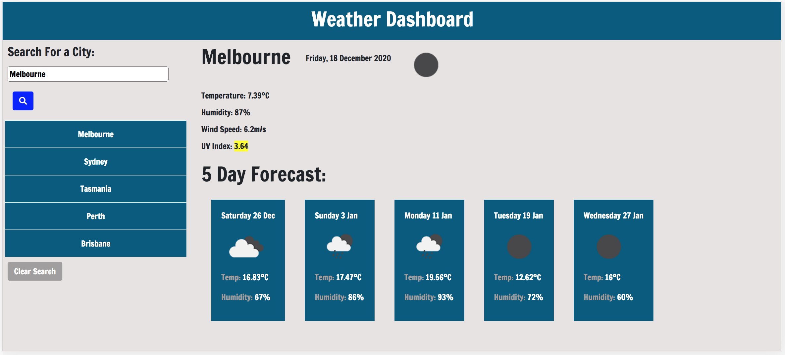

# Weather-Dashboard 

A weather dashboard built for travellers allowing them to see the weather outlook for cities around the world to help them plan their trip. 

Travellers can search for their destination city and will be presented with current weather information as well as 5-day forecast for their requested city. Information includes date, weather conditions, temperature, humidity, wind speed and UV index. All previous city searches will be saved in their search history and can be accessed again at a later time. 

# Technologies utilised

HTML, CSS, Javascript, JQuery, local storage and Third Party API's

# Links

https://karryns.github.io/Weather-Dashboard/

# ScreenShot

